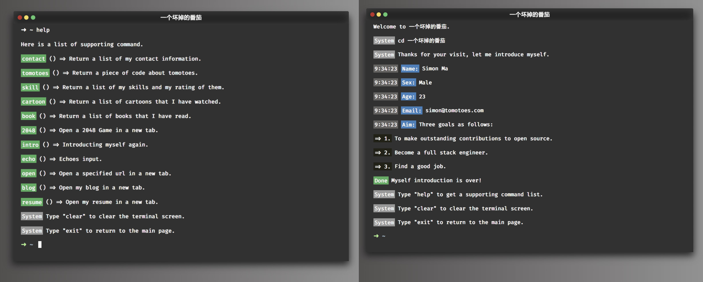

<div align="center">
	
	<br>
	<h1>React-terminal</h1>
	<sub>Built with ❤︎ by <a href="https://tomotoes.com">Simon Ma</a> - <a href="https://github.com/Tomotoes/react-terminal">English document</a></sub>
</div>
<hr/>
<p align="center">🚀 <strong>一个简洁&漂亮的终端模拟应用</strong></p>
<p align="center">
  <a href="https://github.com/feross/standard">
    
  </a>
  <a href="https://reactjs.org/">
    
  </a>
  <a href="https://github.com/Tomotoes/react-terminal/issues"></a>
</p>

## 👀目录

- [🎉简介](https://github.com/Tomotoes/react-terminal/blob/master/README.zh_CN.md#简介)
- [💡安装](https://github.com/Tomotoes/react-terminal/blob/master/README.zh_CN.md#安装)
- [✨使用](https://github.com/Tomotoes/react-terminal/blob/master/README.zh_CN.md#使用)
- [🎨TODO](https://github.com/Tomotoes/react-terminal/blob/master/README.zh_CN.md#todo)
- [🎯开发](https://github.com/Tomotoes/react-terminal/blob/master/README.zh_CN.md#开发)
- [💚赞赏](https://github.com/Tomotoes/react-terminal/blob/master/README.zh_CN.md#赞赏)
- [📃协议](https://github.com/Tomotoes/react-terminal/blob/master/README.zh_CN.md#协议)


## 🎉简介



[在线体验](https://tomotoes.com/about/)

[`React-terminal`](https://tomotoes.com/about/) 是一款终端模拟应用，其诞生离不开 [vue-terminal](https://github.com/dongsuo/vue-terminal) 开源项目。

如果你正在找一款展示信息的交互式应用，那么 `React-terminal` 会是你很好的选择。

`React-terminal` 所支持的特性如下：

1. 内置系统命令：`ls`,`cd`,`pwd`，`echo` 等
2. 可使用`tab`自动补全命令
3. 可使用方向键回到历史命令
4. 可自定义所有命令样式
5. 与JS结合，可任意模拟系统命令


在下一个项目中使用React Terminal的一些想法：

- **个人网站**：展示个人信息，或交互式简历。
- **Demos**：在JavaScript中为CLI应用程序创建模拟命令，并让用户在浏览器中尝试模拟输出的命令。


## 💡安装

```sh
npm i react-terminal-app
```

OR

```sh
yarn add react-terminal-app
```

此应用依赖于`react`, 请确保你已经安装。


## ✨使用

```jsx
import Terminal from 'react-terminal-app'

// 可参考: https://github.com/Tomotoes/react-terminal/blob/master/demo/src/commands
import staticList from 'command/static'
import dynamicList from 'command/dynamic'

const cmd = {
  dynamicList,
  staticList
}

const config = {
  prompt: '➜  ~ ',
  version: '1.0.0',
  initialDirectory: 'workspace',
  bootCmd: 'intro'
}

function App() {
   return <Terminal cmd={cmd} config={config} />
}
```


### 数据结构

#### PropTypes

```js
{
    cmd: PropTypes.shape({
      dynamicList: PropTypes.object,
      staticList: PropTypes.object
    }).isRequired,
 
    config: PropTypes.shape({
      initialDirectory: PropTypes.string,
      prompt: PropTypes.string,
      version: PropTypes.string,
      bootCmd: PropTypes.string
    }),
        
    className: PropTypes.string,
}
```


#### Command

> Command是一个对象，用于定义终端中显示的消息格式：

```ts
interface ICommand {
    time?: string; // time to show time before command body
	type?: string; // label to show a label before command body
	label?: string; // type to set command's type, will set a class to command's label part, there is 7 builtin types: error, success, info, warning, system, black, time
    content?: string; // the main text showed in terminal.
    [propName: string]: any;
}
type command = ICommand | string
```


### Props

#### className

`React-terminal` 根节点的类名, 可用来自定义样式，默认值:`react-terimnal-app`


#### config

1. prompt

   终端的命令提示符, 默认值:`➜  ~ `.

2. initialDirectory

   终端默认打开的目录，默认值:`src`

3. version

   终端的版本号, 可执行`version`命令查看, 默认值:`1.0.0`

4. bootCmd

   终端初始化时, 所要执行的命令，默认值：`intro`


#### cmd

1. dynamicList

   > 可进行交互的命令列表

   ```js
   {
     命令名称: {
     	description: 命令描述,
       run(print, input) {
         // print: 打印函数
         // input: 当前输入的命令参数
         // eg: echo HelloWorld, input 传入的值便是HelloWorld
         return new Promise((resolve,reject) => {
           // do something
         })
       }
     }
   }
   ```

   eg: 定义一个`open`命令, 来打开输入的网址

   ```js
   export default {
     open: {
       description: 'Open a specified url in a new tab.',
       run(print, input) {
         return new Promise((resolve,reject) => {
           if (!input) {
             return reject({ type: 'error', label: 'Error', content: 'a url is required!' })
           }
           if (!input.startsWith('http')) {
             return reject({ type: 'error', label: 'Error', content: 'Please add `http` prefix!' })
           }
           print({ type: 'success', label: 'Success', content: 'Opening' })
           window.open(input, '_blank')
           resolve({ type: 'success', label: 'Done', content: 'Page Opened!' })
         })
       }
     }
   }
   ```

2. staticList

   > 只展示数据的命令列表

   ```js
   {
     命令名称: {
     	description: 命令描述,
       list: [ <command> ]
     }
   }
   ```

	eg: 定义一个`skills`命令, 用来显示个人所掌握的技能
	
	```js
	  skill: {
	    description: 'Return a list of my skills and my rating of them.',
	    list: [
	      { type: 'success', label: 'A', content: '· JavaScript 99/100' },
	      { type: 'success', label: 'A', content: '· Go 90/100' },
	      { type: 'success', label: 'A', content: '· Java 80/100' },
	      { type: 'success', label: 'A', content: '· Kotlin 80/100' }
	   ]}
	```


### 内置命令

#### System命令

  - `clear | cls` - clears the screen
   - `help | ls` - list all the commands
   - `exit | back` - exit the current session
   - `pwd` - print name of current directory
   - `cd` - change the current directory
   - `version` - print the version of current app


#### 提示命令

- 跳转页面时 - `Jumping page...`

- 命令未找到时 

  ````js
  command => `Command '${command}' not found`
  ````

- help 命令的提示语 - `Here is a list of supporting command.`

- 出错时 - `'Something went wrong!'`


## 🎨TODO

1. 增加终端左上角按钮点击功能
2. 增加更多系统命令
3. 使终端主题可定制
4. 增加多行输入功能
5. 增加插件系统支持


## 🎯开发

项目使用的脚手架是[nwb](https://github.com/insin/nwb)。

```sh
git clone https://github.com/Tomotoes/react-terminal
cd react-terminal
npm install
npm start
```

如果你有任何问题，欢迎提交 `Issues` 或 `PR`！


## 💚赞赏

如果你喜欢`React-terminal`，并且它对你确实有帮助，欢迎给我打赏一杯咖啡哈~

paypal: [https://paypal.me/tomotoes](https://paypal.me/tomotoes)

[](https://cdn.jsdelivr.net/gh/Tomotoes/images/blog/alipay.png)[](https://cdn.jsdelivr.net/gh/Tomotoes/images/blog/wechat.png)


## 📃协议

MIT License © Simon Ma